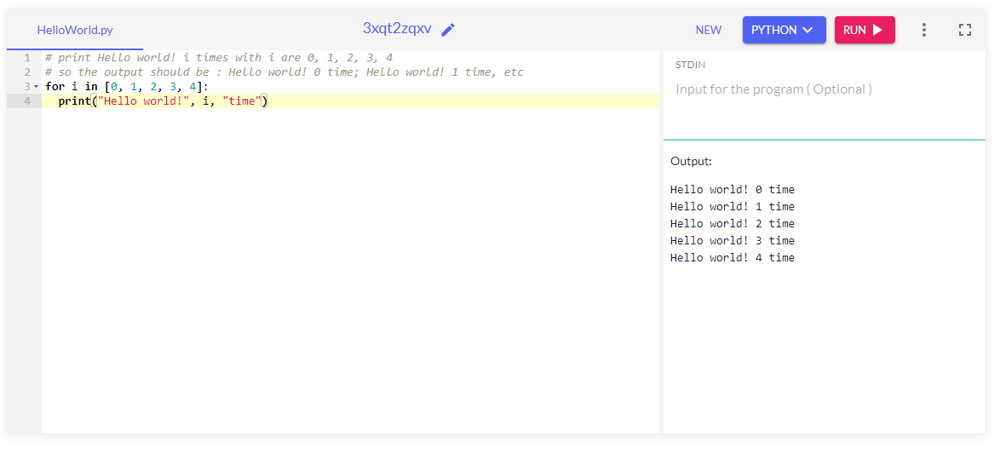

# Assignment 02
## Question

What is the results of following code?
```python
for i in [0, 1, 2, 3, 4]:
  print("Hello world!", i, "time")
```

## Answer
```
Hello world! 0 time
Hello world! 1 time
Hello world! 2 time
Hello world! 3 time
Hello world! 4 time
```
Edited in [OneCompiler](https://onecompiler.com/python/3xqt2zqxv)


