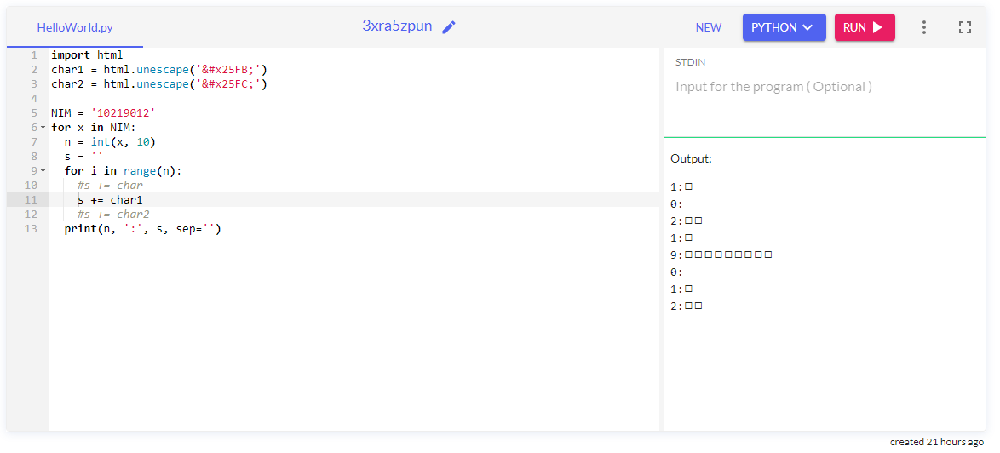

# Assignment 03
Terdapat kode Python berikut ini yang akan digunakan.
```python
import html
char1 = html.unescape('&#x25FB;')
char2 = html.unescape('&#x25FC;')

NIM = '10298345'
for x in NIM:
  n = int(x, 10)
  s = ''
  for i in range(n):
    s += char
  print(n, ':', s, sep='')
```

## Question 1
Ganti nilai variabel NIM dengan data Anda, jalankan kode yang diberikan, dan tampilkan hasilnya.

### Answer 1
Hasil kode di atas adalah
```
Traceback (most recent call last):
  File "HelloWorld.py", line 10, in <module>
    s += char
NameError: name 'char' is not defined
```
> Hal ini terjadi karena dalam kode yang diberikan variabel 'char' belum dinyatakan atau di-*declare*


di-*compile* menggunakan [OneCompiler (3xra5zpun)](https://onecompiler.com/python/3xra5zpun)

## Question 2
Ganti nilai variabel NIM dengan data Anda, modifikasi kode yang diberikan di atas dengan `s += char1`, jalankan dan tampilkan hasilnya.

### Answer 2
Hasil modifikasi kode di atas adalah
```
1:◻
0:
2:◻◻
1:◻
9:◻◻◻◻◻◻◻◻◻
0:
1:◻
2:◻◻
```
> Hasil ini didapatkan dari 
> + variabel 'char1' yang menyimpan karakter khusus dengan unicode hex &#x25FB untuk bentuk kotak dengan tengah kosong (◻), 
dipanggil menggunakan method html.unescape()
> + kemudian karakter tersebut diulang sebanyak angka yang terdapat pada NIM. 
Misalkan : (1:◻); (0: ); (2:◻◻) dst 



di-*compile* menggunakan [OneCompiler (3xra5zpun)](https://onecompiler.com/python/3xra5zpun)

## Question 3
Ganti nilai variabel NIM dengan data Anda, modifikasi kode yang diberikan di atas dengan `s += char2`, jalankan dan tampilkan hasilnya.

### Answer 3
Hasil modifikasi kode di atas adalah
```
1:◼
0:
2:◼◼
1:◼
9:◼◼◼◼◼◼◼◼◼
0:
1:◼
2:◼◼

```
> Hasil yang didapatkan mirip dengan pertanyaan sebelumnya, bedanya terdapat pada Unicode Hex kotak hitam (◼) yang disimpan di variabel 'char2'


di-*compile* menggunakan [OneCompiler (3xra5zpun)](https://onecompiler.com/python/3xra5zpun)

## Question 4
Jelaskan dengan singkat hal yang dihasillkan oleh kode yang diberikan.

### Answer 4
Kode di atas berfungsi untuk
+ Menggunakan method html.unescape(), *ascii string* dapat dirubah menjadi *html script* sehingga dapat menampilkan karakter khusus
+ Karakter khusus tadi dipanggil kemudian disusun-ulang menggunakan *loop* sebanyak angka yang ada pada urutan NIM 
